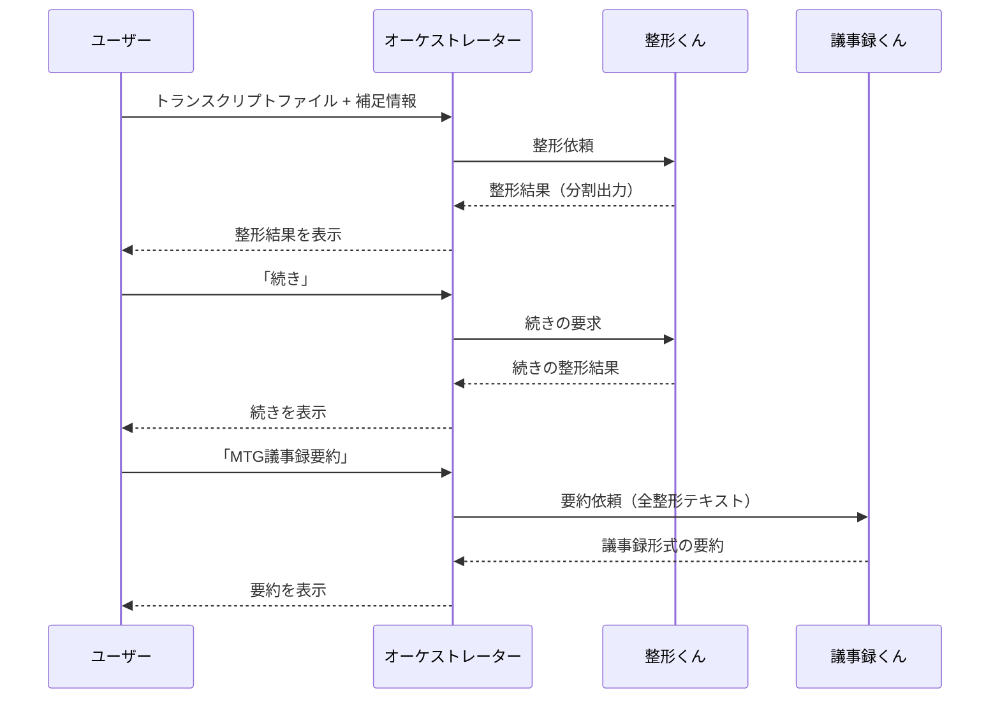

# トランスクリプト要約の達人 - オーケストレーターエージェント

Microsoft 365 Copilot の **Declarative Agent（宣言型エージェント）** と **Connected Agents（接続エージェント）機能** を活用した、複数エージェント連携システムです。

---

## 目次

1. [概要](#概要)
2. [アーキテクチャ](#アーキテクチャ)
3. [プロジェクト構成](#プロジェクト構成)
4. [各ファイルの役割](#各ファイルの役割)
5. [セットアップ手順](#セットアップ手順)
6. [拡張方法](#拡張方法)
7. [トラブルシューティング](#トラブルシューティング)
8. [参考リンク](#参考リンク)

---

## 概要

### このエージェントの目的

会議のトランスクリプト（文字起こし）を、以下の2段階で処理します：

| フェーズ | 処理内容 | 担当エージェント |
|---------|---------|----------------|
| **フェーズ1** | トランスクリプトの整形（話者分離、専門用語補正） | トランスクリプト整形くん |
| **フェーズ2** | 用途に応じた要約生成 | MTG議事録くん / 質疑応答くん / スライドレビューくん |

### Connected Agents機能とは

Microsoft 365 Copilotの機能で、**オーケストレーターエージェント**が複数の**ワーカーエージェント**を呼び出して連携処理を行う仕組みです。

```
┌─────────────────────────────────────────────────────────┐
│                      ユーザー                            │
└─────────────────────────────────────────────────────────┘
                           │
                           ▼
┌─────────────────────────────────────────────────────────┐
│        トランスクリプト要約の達人（オーケストレーター）        │
│                   本プロジェクト                          │
└─────────────────────────────────────────────────────────┘
                           │
       ┌───────────────────┼───────────────────┐
       ▼                   ▼                   ▼
┌─────────────┐    ┌─────────────┐    ┌─────────────┐
│整形くん      │    │議事録くん    │    │質疑応答くん  │
│(WORKER_1)   │    │(WORKER_2)   │    │(WORKER_3)   │
└─────────────┘    └─────────────┘    └─────────────┘
                                              │
                                    ┌─────────┘
                                    ▼
                           ┌─────────────┐
                           │スライド      │
                           │レビューくん   │
                           │(WORKER_4)   │
                           └─────────────┘
```

---

## アーキテクチャ

### Declarative Agent（宣言型エージェント）の構造

```
App Package (ZIP)
├── manifest.json           ← Microsoft 365 プラットフォーム登録情報
├── declarativeAgent.json   ← エージェントの動作定義
├── instruction.txt         ← システムプロンプト（LLMへの指示）
├── color.png              ← アイコン（カラー版）
└── outline.png            ← アイコン（アウトライン版）
```

### 処理フロー



---

## プロジェクト構成

```
プロジェクトルート/
├── 📁 appPackage/                    # エージェント定義（コア）
│   ├── manifest.json                 # アプリマニフェスト
│   ├── declarativeAgent.json         # エージェント設定
│   ├── instruction.txt               # システムプロンプト
│   ├── color.png                     # カラーアイコン
│   ├── outline.png                   # アウトラインアイコン
│   └── 📁 build/                     # ビルド成果物（自動生成）
│
├── 📁 env/                           # 環境変数
│   ├── .env.local                    # ローカル開発用（gitignore）
│   ├── .env.local.user               # ローカル用シークレット（gitignore）
│   ├── .env.dev                      # 開発環境用
│   └── .env.dev.user                 # 開発環境用シークレット（gitignore）
│
├── 📁 .vscode/                       # VS Code設定
│   ├── launch.json                   # デバッグ構成
│   ├── tasks.json                    # タスク定義
│   ├── settings.json                 # プロジェクト設定
│   ├── mcp.json                      # MCPサーバー設定
│   └── extensions.json               # 推奨拡張機能
│
├── 📁 .github/                       # GitHub設定
│   └── copilot-instructions.md       # GitHub Copilot用指示
│
├── m365agents.yml                    # プロビジョニング設定（開発/本番）
├── m365agents.local.yml              # プロビジョニング設定（ローカル）
├── .gitignore                        # Git除外設定
└── README.md                         # 本ドキュメント
```

---

## 各ファイルの役割

### 🔷 `appPackage/manifest.json` - アプリマニフェスト

Microsoft 365 プラットフォームへのアプリ登録情報を定義します。

| プロパティ | 説明 | 本プロジェクトの設定 |
|-----------|------|---------------------|
| `$schema` | スキーマバージョン | v1.24 |
| `id` | アプリID（環境変数から注入） | `${{TEAMS_APP_ID}}` |
| `name.short` | 表示名 | トランスクリプト要約の達人 |
| `copilotAgents` | Copilotエージェント定義 | declarativeAgent.jsonを参照 |

```json
{
  "copilotAgents": {
    "declarativeAgents": [{
      "id": "declarativeAgent",
      "file": "declarativeAgent.json"  // ← エージェント設定ファイル
    }]
  }
}
```

### 🔷 `appPackage/declarativeAgent.json` - エージェント設定

エージェントの動作を定義するコアファイルです。

| プロパティ | 説明 | 本プロジェクトの設定 |
|-----------|------|---------------------|
| `$schema` | スキーマバージョン | v1.6 |
| `instructions` | システムプロンプト | instruction.txtを参照 |
| `conversation_starters` | クイックアクションボタン | 4つの処理を定義 |
| `worker_agents` | 接続エージェント | 4つのワーカーを定義 |

```json
{
  "instructions": "$[file('instruction.txt')]",
  "conversation_starters": [
    { "title": "トランスクリプトを整形", "text": "..." },
    { "title": "MTG議事録要約", "text": "..." }
  ],
  "worker_agents": [
    { "id": "${{WORKER_AGENT_1_TITLE_ID}}" },  // 整形くん
    { "id": "${{WORKER_AGENT_2_TITLE_ID}}" },  // 議事録くん
    { "id": "${{WORKER_AGENT_3_TITLE_ID}}" },  // 質疑応答くん
    { "id": "${{WORKER_AGENT_4_TITLE_ID}}" }   // スライドレビューくん
  ]
}
```

### 🔷 `appPackage/instruction.txt` - システムプロンプト

LLMへの指示を記述します。本プロジェクトでは以下を定義：

- **役割定義**: 情報の「橋渡し」役（編集禁止）
- **フェーズ1**: トランスクリプト整形フロー
- **フェーズ2**: 要約処理フロー
- **ルール**: エージェント出力の無編集転送

### 🔷 `env/.env.dev` - 環境変数（開発環境）

```env
# 環境識別
TEAMSFX_ENV=dev
APP_NAME_SUFFIX=dev
AGENT_SCOPE=shared

# 自動生成ID（Provision時に設定）
TEAMS_APP_ID=2f1929bc-...
M365_TITLE_ID=T_a4e6dbd8-...

# ★ ワーカーエージェントID（手動設定が必要）
WORKER_AGENT_1_TITLE_ID=T_47bdc189-...  # 整形くん
WORKER_AGENT_2_TITLE_ID=T_35e2f1f3-...  # 議事録くん
WORKER_AGENT_3_TITLE_ID=T_268c0d56-...  # 質疑応答くん
WORKER_AGENT_4_TITLE_ID=T_8f150434-...  # スライドレビューくん
```

### 🔷 `m365agents.yml` / `m365agents.local.yml` - プロビジョニング設定

Infrastructure as Code として、エージェントのデプロイ手順を定義します。

| アクション | 説明 |
|-----------|------|
| `teamsApp/create` | Developer Portalにアプリ作成 |
| `teamsApp/zipAppPackage` | appPackageをZIP化 |
| `teamsApp/validateAppPackage` | パッケージ検証 |
| `teamsApp/update` | Developer Portalに反映 |
| `teamsApp/extendToM365` | Microsoft 365全体に展開 |
| `teamsApp/publishAppPackage` | 管理センターに公開申請 |

**ローカル版との違い:**

| 項目 | `m365agents.yml` | `m365agents.local.yml` |
|------|------------------|------------------------|
| `AGENT_SCOPE` | `shared`（組織共有） | なし（個人のみ） |
| `publish`セクション | あり | なし |

---

## セットアップ手順

### 前提条件

- [Node.js](https://nodejs.org/) v18/20/22
- [Microsoft 365 Agents Toolkit](https://marketplace.visualstudio.com/items?itemName=TeamsDevApp.ms-teams-vscode-extension) v5.0.0以上
- [Microsoft 365 Copilot ライセンス](https://learn.microsoft.com/microsoft-365-copilot/extensibility/prerequisites)
- **ワーカーエージェント4つ（事前デプロイ済み）**

### 手順

#### 1. ワーカーエージェントのTitle ID取得

各ワーカーエージェントをProvision後、以下のいずれかで取得：

- Provision実行時のコンソール出力
- `env/.env.*.user` ファイル内の `M365_TITLE_ID`
- [デベロッパーモード](https://learn.microsoft.com/microsoft-365-copilot/extensibility/debugging-agents-copilot-studio)でメタデータ確認

#### 2. 環境変数設定

`env/.env.dev` にワーカーエージェントのTitle IDを設定：

```env
WORKER_AGENT_1_TITLE_ID=T_xxxxxxxx-xxxx-xxxx-xxxx-xxxxxxxxxxxx
WORKER_AGENT_2_TITLE_ID=T_xxxxxxxx-xxxx-xxxx-xxxx-xxxxxxxxxxxx
WORKER_AGENT_3_TITLE_ID=T_xxxxxxxx-xxxx-xxxx-xxxx-xxxxxxxxxxxx
WORKER_AGENT_4_TITLE_ID=T_xxxxxxxx-xxxx-xxxx-xxxx-xxxxxxxxxxxx
```

#### 3. プロビジョニング実行

VS Codeで:
1. Microsoft 365 Agents Toolkit アイコンをクリック
2. Accountセクションでサインイン
3. `Preview Local in Copilot (Edge)` または `(Chrome)` を実行

---

## 拡張方法

### 1. ワーカーエージェントの追加

```json
// filepath: appPackage/declarativeAgent.json
{
  // ...existing code...
  "worker_agents": [
    { "id": "${{WORKER_AGENT_1_TITLE_ID}}" },
    { "id": "${{WORKER_AGENT_2_TITLE_ID}}" },
    { "id": "${{WORKER_AGENT_3_TITLE_ID}}" },
    { "id": "${{WORKER_AGENT_4_TITLE_ID}}" },
    { "id": "${{WORKER_AGENT_5_TITLE_ID}}" }  // 新規追加
  ]
}
```

```env
// filepath: env/.env.dev
// ...existing code...
WORKER_AGENT_5_TITLE_ID=T_新しいエージェントのTitleID
```

### 2. 会話スターターの追加

```json
// filepath: appPackage/declarativeAgent.json
{
  // ...existing code...
  "conversation_starters": [
    // ...existing code...
    {
      "title": "アクション抽出",
      "text": "整形済みトランスクリプトからアクションアイテムを抽出してください。"
    }
  ]
}
```

### 3. データソース（Capabilities）の追加

#### SharePoint/OneDrive連携

```json
// filepath: appPackage/declarativeAgent.json
{
  // ...existing code...
  "capabilities": [
    {
      "name": "OneDriveAndSharePoint",
      "items_by_url": [
        { "url": "https://contoso.sharepoint.com/sites/MeetingDocs" }
      ]
    }
  ]
}
```

#### Graph Connectors（エンタープライズ検索）

```json
// filepath: appPackage/declarativeAgent.json
{
  // ...existing code...
  "capabilities": [
    {
      "name": "GraphConnectors",
      "connections": [
        { "connection_id": "your-connection-id" }
      ]
    }
  ]
}
```

#### Webサイト検索

```json
// filepath: appPackage/declarativeAgent.json
{
  // ...existing code...
  "capabilities": [
    {
      "name": "WebSearch",
      "allow_list": [
        "https://docs.microsoft.com/*",
        "https://learn.microsoft.com/*"
      ]
    }
  ]
}
```

### 4. APIプラグインの追加

外部APIを呼び出す場合：

```json
// filepath: appPackage/declarativeAgent.json
{
  // ...existing code...
  "actions": [
    {
      "id": "transcriptApi",
      "file": "apiPlugin.json"
    }
  ]
}
```

新規ファイル `appPackage/apiPlugin.json` を作成し、OpenAPI仕様でAPIを定義。

### 5. 新環境の追加（staging等）

1. `env/.env.staging` を作成
2. `TEAMSFX_ENV=staging` を設定
3. VS Codeから環境を選択してProvision実行

---

## トラブルシューティング

### よくある問題

| 症状 | 原因 | 対処法 |
|------|------|--------|
| ワーカーが呼び出せない | Title IDが未設定または不正 | `.env.*` ファイルを確認 |
| エージェントが表示されない | Provisionが未完了 | `Provision` を再実行 |
| 「続き」で処理が止まる | ワーカーが未インストール | ユーザーにワーカーをインストール |

### 制約事項

⚠️ **テキストのみ通信**: エージェント間ではファイルバイナリ・画像は送信不可

⚠️ **事前インストール必須**: 各ワーカーはユーザーに事前インストールが必要

⚠️ **プレビュー機能**: Connected Agents機能は現在プレビュー段階

---

## 参考リンク

### 公式ドキュメント

- [Declarative agents for Microsoft 365 Copilot](https://learn.microsoft.com/microsoft-365-copilot/extensibility/overview-declarative-agent)
- [Connect to other agents](https://learn.microsoft.com/microsoft-365-copilot/extensibility/declarative-agent-connected-agent)
- [Declarative agent manifest schema v1.6](https://learn.microsoft.com/microsoft-365-copilot/extensibility/declarative-agent-manifest-1.6)
- [App manifest schema v1.24](https://learn.microsoft.com/microsoftteams/platform/resources/schema/manifest-schema)

### ツールキット

- [Microsoft 365 Agents Toolkit](https://marketplace.visualstudio.com/items?itemName=TeamsDevApp.ms-teams-vscode-extension)
- [CLI (`@microsoft/m365agentstoolkit-cli`)](https://www.npmjs.com/package/@microsoft/m365agentstoolkit-cli)

### サンプル・チュートリアル

- [Build declarative agents](https://learn.microsoft.com/microsoft-365-copilot/extensibility/build-declarative-agents)
- [Add API plugins](https://learn.microsoft.com/microsoft-365-copilot/extensibility/build-declarative-agents?tabs=ttk&tutorial-step=7)
## 参考リンク

- [Connect to other agents from a declarative agent](https://learn.microsoft.com/microsoft-365-copilot/extensibility/declarative-agent-connected-agent)
- [Declarative agent schema v1.6](https://learn.microsoft.com/microsoft-365-copilot/extensibility/declarative-agent-manifest-1.6)
- [Microsoft 365 Agents Toolkit ガイド](https://github.com/OfficeDev/TeamsFx/wiki/Teams-Toolkit-Visual-Studio-Code-v5-Guide#overview)
- [Add API plugins](https://learn.microsoft.com/microsoft-365-copilot/extensibility/build-declarative-agents?tabs=ttk&tutorial-step=7) for agent to interact with REST APIs.

## Addition information and references

- [Declarative agents for Microsoft 365](https://aka.ms/teams-toolkit-declarative-agent)
