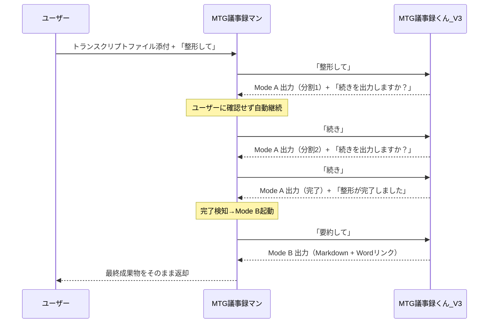

# MTG議事録マン - 仲介エージェント

Microsoft 365 Copilot の **Declarative Agent（宣言型エージェント）** と **Connected Agents（接続エージェント）機能** を活用した、議事録作成の自動化エージェントです。

---

## 目次

1. [概要](#概要)
2. [アーキテクチャ](#アーキテクチャ)
3. [プロジェクト構成](#プロジェクト構成)
4. [各ファイルの役割](#各ファイルの役割)
5. [セットアップ手順](#セットアップ手順)
6. [拡張方法](#拡張方法)
7. [トラブルシューティング](#トラブルシューティング)
8. [参考リンク](#参考リンク)

---

## 概要

### このエージェントの目的

会議のトランスクリプト（文字起こし）を受け取り、**ユーザーの代わりに「MTG議事録くん_V3」を操作**して、議事録のMarkdownとWordファイルを自動生成します。

### 主な特徴

- **完全自動化**: ユーザーが1回入力するだけで、内部で自動的に「続き」「要約して」を送り、最終成果物まで取得
- **仲介特化**: 本エージェントは編集・要約を一切行わず、MTG議事録くん_V3の出力をそのままユーザーに返す
- **2モード処理**:
  - **Mode A**: トランスクリプトの整形・修復（分割出力）
  - **Mode B**: 議事録の生成（Markdown + Wordダウンロードリンク）

### Connected Agents機能とは

Microsoft 365 Copilotの機能で、**仲介エージェント**が**ワーカーエージェント（MTG議事録くん_V3）**を操作して処理を行う仕組みです。

```
┌─────────────────────────────────────────────┐
│              ユーザー                        │
└─────────────────────────────────────────────┘
                    │
                    ▼
┌─────────────────────────────────────────────┐
│      MTG議事録マン（仲介エージェント）        │
│            本プロジェクト                     │
└─────────────────────────────────────────────┘
                    │
                    ▼
┌─────────────────────────────────────────────┐
│      MTG議事録くん_V3（ワーカー）             │
│                                             │
│  Mode A: 整形・修復（分割出力）               │
│  Mode B: 議事録生成（Markdown + Word）        │
└─────────────────────────────────────────────┘
```

---

## アーキテクチャ

### Declarative Agent（宣言型エージェント）の構造

```
App Package (ZIP)
├── manifest.json           ← Microsoft 365 プラットフォーム登録情報
├── declarativeAgent.json   ← エージェントの動作定義
├── instruction.txt         ← システムプロンプト（仲介ロジック）
├── color.png              ← アイコン（カラー版）
└── outline.png            ← アイコン（アウトライン版）
```

### 処理フロー（自動完走）



---

## プロジェクト構成

```
プロジェクトルート/
├── 📁 appPackage/                    # エージェント定義（コア）
│   ├── manifest.json                 # アプリマニフェスト
│   ├── declarativeAgent.json         # エージェント設定
│   ├── instruction.txt               # システムプロンプト（仲介ロジック）
│   ├── color.png                     # カラーアイコン
│   ├── outline.png                   # アウトラインアイコン
│   └── 📁 build/                     # ビルド成果物（自動生成）
│
├── 📁 env/                           # 環境変数
│   ├── .env.local                    # ローカル開発用（gitignore）
│   ├── .env.local.user               # ローカル用シークレット（gitignore）
│   ├── .env.dev                      # 開発環境用
│   └── .env.dev.user                 # 開発環境用シークレット（gitignore）
│
├── 📁 .vscode/                       # VS Code設定
│   ├── launch.json                   # デバッグ構成
│   ├── tasks.json                    # タスク定義
│   ├── settings.json                 # プロジェクト設定
│   ├── mcp.json                      # MCPサーバー設定
│   └── extensions.json               # 推奨拡張機能
│
├── 📁 .github/                       # GitHub設定
│   └── copilot-instructions.md       # GitHub Copilot用指示
│
├── m365agents.yml                    # プロビジョニング設定（開発/本番）
├── m365agents.local.yml              # プロビジョニング設定（ローカル）
├── .gitignore                        # Git除外設定
└── README.md                         # 本ドキュメント
```

---

## 各ファイルの役割

### 🔷 `appPackage/manifest.json` - アプリマニフェスト

Microsoft 365 プラットフォームへのアプリ登録情報を定義します。

| プロパティ | 説明 | 本プロジェクトの設定 |
|-----------|------|---------------------|
| `$schema` | スキーマバージョン | v1.24 |
| `id` | アプリID（環境変数から注入） | `${{TEAMS_APP_ID}}` |
| `name.short` | 表示名 | MTG議事録マン |
| `description` | 説明 | 会議のトランスクリプトの入力を受け取り、「MTG議事録くん_V3」によって議事録を作成・整形します。 |
| `copilotAgents` | Copilotエージェント定義 | declarativeAgent.jsonを参照 |

```json
{
  "copilotAgents": {
    "declarativeAgents": [{
      "id": "declarativeAgent",
      "file": "declarativeAgent.json"
    }]
  }
}
```

### 🔷 `appPackage/declarativeAgent.json` - エージェント設定

エージェントの動作を定義するコアファイルです。

| プロパティ | 説明 | 本プロジェクトの設定 |
|-----------|------|---------------------|
| `$schema` | スキーマバージョン | v1.6 |
| `name` | エージェント名 | MTG議事録マン |
| `instructions` | システムプロンプト | instruction.txtを参照 |
| `conversation_starters` | クイックアクションボタン | 「MTG議事録の整形」のみ |
| `worker_agents` | 接続エージェント | MTG議事録くん_V3 のみ |

```json
{
  "instructions": "$[file('instruction.txt')]",
  "conversation_starters": [
    {
      "title": "MTG議事録の整形",
      "text": "添付ファイルを整形して．"
    }
  ],
  "worker_agents": [
    {
      "id": "${{WORKER_AGENT_TITLE_ID}}"
    }
  ]
}
```

### 🔷 `appPackage/instruction.txt` - システムプロンプト

LLMへの指示を記述します。本プロジェクトでは以下を定義：

- **役割定義**: 「仲介エージェント」として動作（編集・要約は一切しない）
- **最重要ルール**: MTG議事録くん_V3の出力を改変せずに返す
- **基本フロー**: ユーザー1回入力で自動完走
  1. **ステップ1**: ファイル添付で「整形して」→Mode A起動
  2. **ステップ2**: 「続きを出力しますか？」を検知→自動で「続き」送信
  3. **ステップ3**: 「整形が完了しました」を検知→「要約して」送信（Mode B起動）
  4. **ステップ4**: Mode B出力（Markdown + Wordリンク）をそのままユーザーに返す
- **短い送信コマンド**: 
  - 開始: `整形して`
  - 継続: `続き`
  - 要約: `要約して`
- **禁止事項**: 
  - 仲介エージェント自身が議事録を作成しない
  - 整形・修復・話者推定をしない
  - 分割結果を結合・編集しない

### 🔷 `env/.env.dev` - 環境変数（開発環境）

```env
# 環境識別
TEAMSFX_ENV=dev
APP_NAME_SUFFIX=dev
AGENT_SCOPE=shared

# 自動生成ID（Provision時に設定）
TEAMS_APP_ID=2f1929bc-b44d-4385-a05b-b94c033a6b29
M365_TITLE_ID=T_a4e6dbd8-42f7-4c05-aabf-e06971d18f5b

# ★ ワーカーエージェントID（手動設定が必要）
WORKER_AGENT_TITLE_ID=T_bd14595f-c719-4289-99e8-a469c30fc79c  # MTG議事録くん_V3
```

### 🔷 `m365agents.yml` / `m365agents.local.yml` - プロビジョニング設定

Infrastructure as Code として、エージェントのデプロイ手順を定義します。

| アクション | 説明 |
|-----------|------|
| `teamsApp/create` | Developer Portalにアプリ作成 |
| `teamsApp/zipAppPackage` | appPackageをZIP化 |
| `teamsApp/validateAppPackage` | パッケージ検証 |
| `teamsApp/update` | Developer Portalに反映 |
| `teamsApp/extendToM365` | Microsoft 365全体に展開 |
| `teamsApp/publishAppPackage` | 管理センターに公開申請（本番のみ） |

**ローカル版との違い:**

| 項目 | `m365agents.yml` | `m365agents.local.yml` |
|------|------------------|------------------------|
| `AGENT_SCOPE` | `shared`（組織共有） | なし（個人のみ） |
| `publish`セクション | あり | なし |

---

## セットアップ手順

### 前提条件

- [Node.js](https://nodejs.org/) v18/20/22
- [Microsoft 365 Agents Toolkit](https://marketplace.visualstudio.com/items?itemName=TeamsDevApp.ms-teams-vscode-extension) v5.0.0以上
- [Microsoft 365 Copilot ライセンス](https://learn.microsoft.com/microsoft-365-copilot/extensibility/prerequisites)
- **MTG議事録くん_V3（事前デプロイ済み）**

### 手順

#### 1. MTG議事録くん_V3のTitle ID取得

ワーカーエージェント「MTG議事録くん_V3」をProvision後、以下のいずれかで取得：

- Provision実行時のコンソール出力
- `env/.env.*.user` ファイル内の `M365_TITLE_ID`
- [デベロッパーモード](https://learn.microsoft.com/microsoft-365-copilot/extensibility/debugging-agents-copilot-studio)でメタデータ確認

#### 2. 環境変数設定

`env/.env.dev` にワーカーエージェントのTitle IDを設定：

```env
WORKER_AGENT_TITLE_ID=T_xxxxxxxx-xxxx-xxxx-xxxx-xxxxxxxxxxxx
```

#### 3. プロビジョニング実行

VS Codeで:
1. Microsoft 365 Agents Toolkit アイコンをクリック
2. Accountセクションでサインイン
3. `Preview Local in Copilot (Edge)` または `(Chrome)` を実行

#### 4. 使用方法

1. Microsoft 365 Copilotで「MTG議事録マン」を起動
2. トランスクリプトファイル（Wordなど）を添付
3. 「添付ファイルを整形して」と入力
4. 自動的に処理が完走し、Markdown議事録とWordダウンロードリンクが返される

---

## 拡張方法

### 1. ワーカーエージェントの追加

複数のワーカーエージェントを連携させる場合：

```json
// appPackage/declarativeAgent.json
{
  "worker_agents": [
    { "id": "${{WORKER_AGENT_TITLE_ID}}" },
    { "id": "${{WORKER_AGENT_2_TITLE_ID}}" }
  ]
}
```

```env
// env/.env.dev
WORKER_AGENT_TITLE_ID=T_bd14595f-c719-4289-99e8-a469c30fc79c
WORKER_AGENT_2_TITLE_ID=T_新しいエージェントのTitleID
```

### 2. 会話スターターの追加

ユーザー向けのクイックアクションを増やす場合：

```json
// appPackage/declarativeAgent.json
{
  "conversation_starters": [
    {
      "title": "MTG議事録の整形",
      "text": "添付ファイルを整形して．"
    },
    {
      "title": "質疑応答抽出",
      "text": "Q&Aセクションだけ抽出して．"
    }
  ]
}
```

### 3. システムプロンプトのカスタマイズ

`appPackage/instruction.txt` を編集して、仲介ロジックを変更できます。

**例: 中間出力も表示する場合**

```txt
## ステップ2：継続（Mode Aの分割を最後まで）
- MTG議事録君_V3の出力に「続きを出力しますか？」が含まれたら：
  → その出力をユーザーに表示してから、「続き」を送信
```

### 4. データソース（Capabilities）の追加

#### SharePoint/OneDrive連携

```json
// appPackage/declarativeAgent.json
{
  "capabilities": [
    {
      "name": "OneDriveAndSharePoint",
      "items_by_url": [
        { "url": "https://contoso.sharepoint.com/sites/MeetingDocs" }
      ]
    }
  ]
}
```

#### Graph Connectors（エンタープライズ検索）

```json
// appPackage/declarativeAgent.json
{
  "capabilities": [
    {
      "name": "GraphConnectors",
      "connections": [
        { "connection_id": "your-connection-id" }
      ]
    }
  ]
}
```

#### Webサイト検索

```json
// appPackage/declarativeAgent.json
{
  "capabilities": [
    {
      "name": "WebSearch",
      "allow_list": [
        "https://docs.microsoft.com/*",
        "https://learn.microsoft.com/*"
      ]
    }
  ]
}
```

### 5. APIプラグインの追加

外部APIを呼び出す場合：

```json
// appPackage/declarativeAgent.json
{
  "actions": [
    {
      "id": "transcriptApi",
      "file": "apiPlugin.json"
    }
  ]
}
```

新規ファイル `appPackage/apiPlugin.json` を作成し、OpenAPI仕様でAPIを定義。

### 6. 新環境の追加（staging等）

1. `env/.env.staging` を作成
2. `TEAMSFX_ENV=staging` を設定
3. VS Codeから環境を選択してProvision実行

---

## トラブルシューティング

### よくある問題

| 症状 | 原因 | 対処法 |
|------|------|--------|
| MTG議事録くん_V3が呼び出せない | Title IDが未設定または不正 | `.env.*` ファイルを確認 |
| エージェントが表示されない | Provisionが未完了 | `Provision` を再実行 |
| 「続き」で処理が止まる | ワーカーが未インストール | ユーザーにMTG議事録くん_V3をインストール |
| 自動継続しない | システムプロンプトのキーワード検知が失敗 | instruction.txtの検知条件を確認 |
| Wordリンクが返されない | Mode B起動に失敗 | 「整形が完了しました」検知を確認 |
| Color Iconエラー | アイコンサイズが不正 | color.pngを192x192ピクセルに変更 |
| Full descriptionの警告 | shortとfullが同じ内容 | manifest.jsonのfull descriptionを詳細化 |

### 制約事項

⚠️ **テキストのみ通信**: エージェント間ではファイルバイナリ・画像は送信不可

⚠️ **事前インストール必須**: MTG議事録くん_V3はユーザーに事前インストールが必要

⚠️ **プレビュー機能**: Connected Agents機能は現在プレビュー段階

⚠️ **単一ワーカー設計**: 本プロジェクトはMTG議事録くん_V3専用の仲介エージェント

---

## 参考リンク

### 公式ドキュメント

- [Declarative agents for Microsoft 365 Copilot](https://learn.microsoft.com/microsoft-365-copilot/extensibility/overview-declarative-agent)
- [Connect to other agents](https://learn.microsoft.com/microsoft-365-copilot/extensibility/declarative-agent-connected-agent)
- [Declarative agent manifest schema v1.6](https://learn.microsoft.com/microsoft-365-copilot/extensibility/declarative-agent-manifest-1.6)
- [App manifest schema v1.24](https://learn.microsoft.com/microsoftteams/platform/resources/schema/manifest-schema)

### ツールキット

- [Microsoft 365 Agents Toolkit](https://marketplace.visualstudio.com/items?itemName=TeamsDevApp.ms-teams-vscode-extension)
- [CLI (`@microsoft/m365agentstoolkit-cli`)](https://www.npmjs.com/package/@microsoft/m365agentstoolkit-cli)

### サンプル・チュートリアル

- [Build declarative agents](https://learn.microsoft.com/microsoft-365-copilot/extensibility/build-declarative-agents)
- [Add API plugins](https://learn.microsoft.com/microsoft-365-copilot/extensibility/build-declarative-agents?tabs=ttk&tutorial-step=7)
- [Microsoft 365 Agents Toolkit ガイド](https://github.com/OfficeDev/TeamsFx/wiki/Teams-Toolkit-Visual-Studio-Code-v5-Guide#overview)
